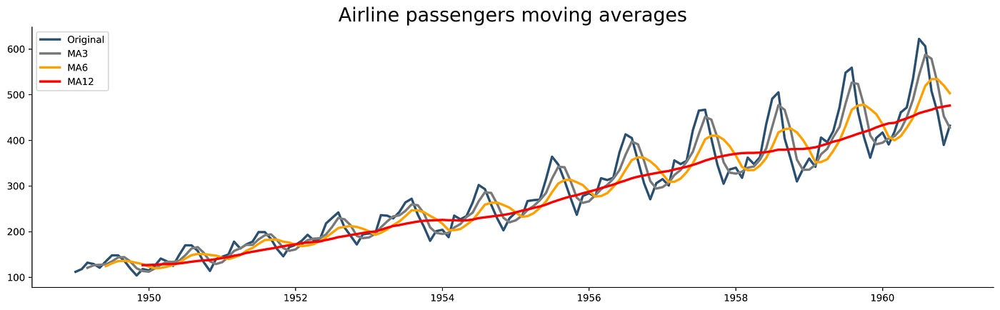

# Time Series
## Ⅰ. 시계열 데이터
시간이 지남에 따라 기록된 정보들을 의미하고, 관측시간에 대한 관측자료의 관계로 표현한다.  
시간 흐름에 따라 변화하는 방향성을 이해하고, 그 변화를 예측하는 것이 주 목적이다.

여름 휴가 기간 동안 특정 해변 도시의 방문자 수를 기록하고 분석하면, 일정한 패턴이나 추세를 찾게 된다.  
이를 통해 다음 해의 방문자 수를 예측하여 관광 산업이나 여행 업계에서 호율적인 운영 및 마케팅 전략을 계획할 수 있다.  
*예를 들어, 양양 해변 도시 방문자를 매일 기록하면, 전체적인 패턴이 보인다. 여름에 많은 패턴이 있을 수 있고 점점 방문자 수가 늘어나면 오르는 추세이다.

 

- 시계열 데이터의 유형에는 우연변동 시계열, 계절 변동 시계열, 추세 변동 시계열, 계절-추세 변동 시계열 데이터가 있다.
- 자료의 인덱스가 시간인 데이터이다. 

 

*index가 시간과 날짜인 데이터 프레임을 **시계열 데이터**(time series)라고 한다.   
*시계열 데이터에서는 이상치(bias)를 쇼크라고 한다. 올해, 작년, 재작년 데이터를 모두 보고 쇼크까지 추가하여 예측하면 된다.

  

### 1. 우연변동 시계열 데이터
특정한 패턴이나 추세 없이 우연한 요소에 의해 변하는 데이터이다.  
패턴이나 규칙이 없고 우연히 발생하는 것처럼 보인다.  
*패턴이 없고 랜덤하며, 우연성 시계열 데이터라고 부르기도 한다.    
*주식이 우연변동 시계열 데이터라고 볼 수 있다.

 

  
  

### 2. 계절변동 시계열 데이터
특정한 시간 주기(예: 일년)에 따라 발생하는 패턴이 나타나는 데이터이다.  
특정 시간에 특정한 일이 반복된다.  
*계절성 시계열 데이터라고 부르기도 한다.  
*물결의 형태를 띄고 있다.

 

  
  

### 3. 추세변동 시계열 데이터
시간에 따라 일정한 방향으로 계속해서 증가하거나 감소하는 추세를 보이는 데이터이다.  
일정한 방향으로 계속해서 증가하거나 감소한다.

*기업에서 매출액 분석 시 추세변동 시계열 데이터가 제일 많이 보인다.  
*얼핏보면 우연변동 시계열 데이터로 보일 수 있으나 멀리서 보면 추세변동 시계열 데이터인 경우가 있다.  
멀리봐야 보이는 데이터이며, 육안으로는 확인이 힘든 부분이 있어 자세히 확인해야 한다.

 

  
  

### 4. 계절-추세변동 시계열 데이터
추세와 계절성 요인이 함계 나타나는 데이터로서, 시간에 따라 일정한 추세가 있고 특정 시간 주기에 따른 패턴이 있는 데이터이다.  
시간이 지남에 따라 일정한 방향으로 움직이면서도 특정 시간에 특정한 일이 반복된다.  

*특정한 시간에 따라 반복되는데 주기도 있는 것을 의미한다. 즉, 계절성도 있는데 추세도 있다는 것이다.  
*플랫하면 단순히 계절변동이며, 주기가 없으면 추세 변동이다. 추세마저 없으면 우연변동 시계열 데이터다.

 

  
  
  
  
  

# Stationarity Differencing
## Ⅰ. 정상성 (定常性, Stationarity = 일관된)
일정해서 늘 한결같은 성질을 뜻한다.'  
*常(상) = 항상 상 =  항상 같다 = 상수 = 한결 같은 성질

관측된 시간에 무관하게 과거, 현재, 미래의 분포가 같아야 한다.

평균, 분산 등이 변하지 않으며 추세나 계절성이 없는 시계열 데이터이다.  
하지만, 정상성을 나타내는 시계열은 장기적으로 볼 때 예측할 수 있는 패턴을 나타내지 않아야 한다. 즉, 불규칙 해야한다.  

즉, 어떤 특정한 주기로 반복하는 계절성이나 위로, 아래로 가능 추세성이 없어야 한다. 

*패턴이 있으면 안되고 일관된 분포를 지닌 정상성을 띄고 있어야 예측이 가능하다.  
*평균과 분산이 변하지 않는다는 것은 추세나 계절성이 없다는 것이고 우연변동도 정상성을 무조건 가지고 있지 않기 때문에 검사해야 한다.  
*정상성은 늘 같다는 것이며 분포나 분산이 항상 일정하고 똑같아야 한다. 예측할 수 있는 패턴이 나오면 안되고 추세나 계절이 없어야 한다.

 

 

- 정상성 = b, g  
- 계절성 = d, h (주기가 있어야하며, 주기별로 변동)  
- 추세 = a, c, e, f  
- 계절-추세 = i  

  
  
  

## Ⅱ. 라그 (Lag)
라그(시차)는 현재 시점에서 이전 시점의 값을 의미하며, 특정 시점 t에서의 라그는 t-k에서의 값을 가리킨다.   
*데이터 프레임이 일별인지 연별인지 모를 때 이전시점을 가르키기 위해서 단위를 **라그**로 통용한 것이다.  
*라그를 2로 줬을 때, 2일이거나 2개월 또는 2년일 수 있다. 이전 시점을 보고 다음을 예측하는 것이다.

 

시계열 데이터에서 패턴과 트렌드를 분석하고 예측하는 데 중요한 개념이다.  
예를 들어, 하루 전의 주식 가격을 이용하여 다음 날의 주식 가격을 예측하는 등의 분석에 사용될 수 있다.  

*라그는 이전 시점을 가르키고 이전 시점 값을 확인할 수 있으니 패턴을 보고 예측까지 할 수 있다.    
*예시로 A 펀드가 있다고 가정하자. 이 A 펀드의 주가가 어떻게 될지 예측하고 싶다면, 전날의 마감을 보고 다음날을 예측할 수 있다.  
내가 라그를 어떻게 설정하느냐에 따라 다음날, 다음 주, 또는 내년까지도 예측이 가능하다. 이때 필요한 용어가 라그(lag)다.  
라그는 시간 시계열 데이터에서 특정 시점의 값이 이전 시점의 값과 어떤 관계가 있는지를 나타내는 데 사용된다.

  
  
  

## Ⅲ. 차분 (Differencing)
연이은 관측값들의 차이를 계산해준다.  
시계열 데이터의 평균과 분산이 일정해야 시계열 값을 예측할 수 있다.  
정상성을 나타내지 않는 시계열에서 정상성을 나타내도록 만드는 방법 중 가장 대표적인 방법이다.  

*차분은 뺄셈이며, 차분 시 정상성이 나타난다. 즉, 차분의 목적은 정상성이다.  
*차분을 통해 정상성을 만들면 예측이 쉬워지고, 예측한 결과 값은 차분된 값이기 때문에 기존에 있었던 값에 더해줘 원래대로 되돌리면 된다.  
*라그된 데이터=이전 데이터, 예측된 데이터=미래

 

차분을 통해 추세나 계절성을 제거하거나 감소시킬 수 있다.  
라그를 사용하여 시계열 데이터를 분석할 때, 라그된 데이터 사이의 차이를 계산하여 차분을 수행한다.  

*예를 들어 아이스크림 사업을 한다고 가정하자. 아이스크림의 물량을 얼만큼 확보해야 할지 모를 때, 어제의 판매량을 본다고 정확하게 준비할 수 있는 것이 아니다.  
주식은 전날을 봐야하지만, 아이스크림 등 물품을 판매할 때는 어제의 판매량만 보면 너무 일부분만 보게 된다.  
따라서, 일주일 전, 한달 전, 작년 등을 라그를 사용하여 보는 것이 맞다.

  
  
  

## Ⅳ. 자기상관 함수(Autocorrelation Function, ACF)
자기상관이란, 현재 시점에서 이전 시점 간의 관련성을 뜻한다.ㅜㅜ
시간 흐름에 따라 각 데이터는 독립적이지 않다. 전일 데이터가 금일 데이터에 영향을 주고, 익일 데이터는 금일 데이터의 영향을 받는다.

시계열의 라그 사이의 선형 관계를 측정해서 시계열 자료의 정상성을 파악할 때 사용한다.  
ACF 그래프는 정상 시계열일 경우 모든 시차에서 0에 근접한 모양을 나타내고,  
비정상 시계열은 천천히 감소할 경우 추세, 물결 모양일 경우 계절이다.  
*설정한 시차에 따라 각각의 시차에 대한 자기상관계수를 계산하게 되고 시차가 증가함에 따라 자기상관계수가 지속적으로 감소한다면,  
시계열 데이터가 정상성(stationarity)을가지고 있다고 볼 수 있다.

 

 

*왼쪽 비정상 시계열, 오른쪽 정상 시계열  
*비정상 시계열을 차분을 통해 정상 시계열로 만든 것이다.  
*왼쪽 이미지는 라그가 증가함에 따라 값이 소폭 감소하는 경향을 보이고 정상성을 가지고 있을 수 있다.

  
  
  

## Ⅴ. 부분자기상관 함수 (Partial ACF, PACF)
다른 시차의 영향을 제거한 후에 나타나는 자기상관을 보여준다.  
해당 시점과 주어진 시차 사이의 관계를 확인할 때, 중간에 있는 시차들의 영향을 배제한다.

현재 시점을 기준으로 lag를 설정하면, 전날과의 차이를 계속 구해 나가는 것이 아니라 전전날, 전전전날 등 부분적으로 영향을 주는 시차를 확인할 수 있다.  
이 때, 다른 시차의 영향을 제거하고 해당 시차와의 상관관계만 측정한다.  

*PACF는 ACF같이 전날의 차이를 계속해서 더하는 게 아닌(누적이 아닌) 부분적으로 딱 한 부분과 자기 상관을 보여준다.

 

PACF를 통해 데이터의 직접적인 상관관계를 파악하는 것은 유용하지만, 정상 시계열과 비정상 시계열을 구분하는 데에 활용하기 어렵다.  

*ACF는 2라그로 설정해도 1라그 단위로 이동하는데, PACF는 정확하게 2라그로 이동한다.  
*PCAF 사용 시 차분할 필요가 없다.

  

## Ⅵ. ACF와 PACF
### 1. ACF

 

시차에 대한 항들이 **누적**된다.  
현재 시점으로 부터 정확히 이전 lag와의 상관관계를 측정하는 것이다.  
ACF는 1라그로 이동한다(2라그 불가).

시계열 데이터의 전반적인 패턴을 파악해서 **추세나 주기성 등 다양한 특성을 확인**할 수 있다.  
차분을 통해 정상 시계열로 변환한 뒤 ACF를 구하면(오른쪽 그래프), 정상성을 가진 시계열에서의 자기상관을 파악할 수 있다.  
*데이터가 정상인지 비정상인지 확인 가능

 

온라인 판매 플랫폼에서 전날 방문자 수와 현재 방문자 수 간의 자기 상관관계를 확인함으로써, 마케팅 활동이나 프로모션 등의 변화가 방문자 수에 미치는 영향을 이해할 수 있게 된다.

  
  

### 2. PACF

 

특정 시차의 영향을 반복적으로 제거한다(**독립적**).  
이전 lag와의 상관관계뿐만 아니라 훨씬 이전의 시차와의 상관관계도 측정할 수 있다.  
직접적인 상관관계를 파악하는 데 유용하고, 특정 시차에 대한 자기상관을 직접적으로 보여준다.  

이를 통해 어떤 시점(k)이 다른 시점(k-t)에 미치는 가에 대한 영향력을 파악하는 데 용이하다.  
이미 정상성을 가진 데이터라면, 차분 없이 PACF를 사용하여 직접적인 상관관계를 파악하는 것이 더 효율적일 수 있다.

주식 시장에서 주가 예측 모델을 구축하는 경우, 특정 시점의 주기와 한 달 전의 주가 간의 직접적인 상관관계를 확인함으로써 한 달 전의 주가 변동이 현재 주가에 미치는 영향을 파악할 수 있게 된다.  
*한마디로, 오늘이랑 어제 중 어떤 날짜가 더 관계가 있는지 보고 싶어 각각인 PACF를 본다고 생각하면 된다(중간 개입 X).

 

*첫번째 시각화는 ACF를 먼저 진행한다.  
ACF로 이저 시점의 데이터와 현재 데이터가 얼마나 상관이 있는지 상관관계를 확인해야 한다(라그 사용 때 도움됨).  
시각화한 데이터가 정상성을 나타내면 0에 가까워지는데 정상 시계열로 볼 수 있다.  
정상시계열이 맞다면, PACF를 시각화하여 PACF 그래프를 보고 상관관계를 확인하며 분석한다.  
즉, PAF는 정상인지 비정상인지 구분이 불가하기 때문에 ACF로 먼저 정상인지 확인하고 PACF로 넘어간다.  
ACF 그래프가 정상이면 차분 없이 비정상이라면 차분 후 진행하면 된다.

  
  
  
  
  

# AR, MA
## Ⅰ. 자기회귀 (AR, Autoregressive Model)
현 시점의 자료가 p시점 전의 유한개의 과거 자료로 설명될 수 있다.  
과거의 데이터가 미래 데이터에 영향을 준다고 가정하는 모델이다.  

현 시점의 시계열 자료에서 몇 번째 전 자료까지 영향을 주는 가를 파악하는 데에 사용한다.
현재 시점의 데이터가 직전 시점의 데이터에만 영향을 받는 모델을 1차 자기회귀 모형이라 하고, AR(1)로 표기한다.

이를 알아내기 위해서는 데이터의 패턴을 분석해야 하고, 이 때 ACF, PACF를 사용한다.  
표준정규분포 영역 내에 들어가는 첫 번째 지점을 절단점이라고 하며, **절단점에서 1을 빼준 값**이 AR모델의 **차수**이다.

  

### 1. ACF  
만약 자기회귀 모델이라면,  
현재 데이터와 멀리 떨어진 과거 데이터의 영향력은 점점 줄어들기 때문에 시간이 지남에 따라 상관관계가 줄어든다.  
*예를 들어, 백년 전과 어제 중 어제의 영향력이 더 크다. 따라서, 점점 감소하는 추세가 나와야 한다.

  
  

### 2. PACF  
만약 자기회귀 모델이라면,  
특정 시점 이후에 급격히 감소하는 모양이 나타난다.

즉, 자기회귀 모델이라면, ACF는 시차가 증가함에 따라 점차 감소하고 PACF는 특정 시점 이후 급격히 감소하여 절단된 형태를 보인다.  
자기회귀 모델을 식별함으로써 데이터의 기본 패턴과 구조를 이해할 수 있고,  
이를 통해 데이터가 어떻게 변동하는지, 과거 데이터가 미래에 어떤 영향을 미치는지에 대한 통찰력을 제공한다.  
*전 시점, 현 시점, 미래 시점을 모두 선형 결합하여 회귀한다.

 

  
  
  

## Ⅱ. 이동평균 (MA, Moving Avearage)
일정 기간 동안의 데이터를 평균하여 시계열 데이터의 부드러운 패턴을 확인할 수 있게 해준다.  
특정 기간 동안의 데이터를 평균한 값으로, 시계열 데이터의 일정 기간 동안의 평균을 보여준다.  
*윈도우 슬라이딩 알고리즘(stride)의 2칸 이동과 유사하다. 평균을 내서 스무딩되고 플랫해진다.

데이터의 변동을 부드럽게 만들어서 패턴을 파악하는 데 도움이 되며, 시계열 데이터의 추세를 이해하고 예측하는 데에 유용한 도구이다.  

*즉, 이동평균(MA) 시 라그 만큼 이동하며 평균을 구해 곡선의 형태로 나타난다.  
*이동평균 사용 시 bias에 민감하지 않기 때문에 쇼크에 대비할 수 있다.  
*예를들어, 아이스크림 가게에서 아이스크림을 팔고 여름에는 판매량이 상승한다고 가정한다.  
아이스크림 물량을 정할 때 일주일 전 판매량 1개 값만 가지고 판단하기는 어려움이 있다.  
따라서, 7일 이동 평균을 구한다. 첫째주, 둘째주, 셋째주의 평균값을 구하는 것이다.

 

  
  
  

## Ⅲ. 안정 시계열 (ARMA)
과거의 데이터와 최근의 평균을 사용하여 시계열 데이터의 패턴을 파악하고 예측하는 데에 사용한다.  
2022년 3월 기준으로 ARMA가 중단되고 ARIMA로 대체되었다.  
*알마는 정상성을 띄어야 하는데,정상성을 띈 시계열은 얼마 안되기 때문에 사용율이 떨어졌다.  
그래서 불안정, 안정 모두 가능한 ARIMA 모델이 활성화 됐다.

ARMA 모델은 시계열 데이터의 과거 값을 기반으로 한 선형 예측 모델이기 때문에  
시계열 데이터가 정상성을 보이고, 예측에 영향을 주는 외부 요인이 없는 등의 가정을 만족해야 한다.

 

- 비정상성 데이터나 비선형적인 패턴을 갖는 데이터의 경우 패턴 파악 및 예측이 어렵다.
- ARMA(1, 0) = AR(1)
- ARMA(0, 1) = MA(1)
- ARMA(1, 1) = AR(1), MA(1)

  
  
  

## Ⅳ. 불안정 시계열 (ARIMA)
ARIMA(p, d, q): d차 차분한 데이터에 AR(p)모형과 MA(q)모형을 합친 모델이다.  

Autoregressive, Integrated(누적 차분), Moving Average의 세 가지 요소로 구성되어 있다.  
I는 비정상 시계열을 정상 시계열로 만들기 위해서 필요한 차분 횟수를 의미한다.  
*ARIMA의 d에 0을 주면 차분을 하지 않는다.

  
  
  

## Ⅴ. 종합 정리
1. 시계열 데이터는 정상성을 띄고 있어야 예측이 가능하다.  

2. 정상성인지 비정상인지 구분하기 위해 ACF을 사용한다.  

3. 비정상성을 띄고 있다면 차분하여 정상성을 띄게 해주고 PACF로 독립적인 상관관계를 확인한다.

4. PACF 그래프를 확인하여 절단 값을 확인하고 절단값에 -1을 하여 AR에 넣을 차수를 결정한다.

5. bias에 대비하기 위해 이동평균(MA)도 함께 사용한다.

6. 여기에 성능을 더 좋게하기 위한 ARMA를 사용하는데, ARMA는 정상성을 띄는 시계열 데이터만 사용이 가능하다.

7. 따라서, 차분까지 진행하는(필수X) ARIMA 모델을 사용한다.

  
  
  
  
  

# Financial Market
## Ⅰ. 금융 시장의 수익률 (Finacial Market Return)
일반적으로 금융 시장을 분석하거나 머신러닝 모델을 구축할 때 price가 아닌 return을 활용하는 경우가 많다.  
수익률을 통해 **복리계산**과 **연율화**(1년 간의 성장률)등을 위해 무수히 많은 반복 계산을 하게 되므로  
(1 + return)으로 계산할 경우 **복잡**하고 번거로워진다.

기존 return에 log를 취해주면, 더 편한 계산이 가능해지지만 당연히 약간의 오차는 발생하게 된다.  
약간의 오차를 감수하고 로그를 사용함으로써 얻는 이득이 훨씬 많고, 국내 주식에서의 상한선과 하한선은 -30% ~ 30% 제약까지 있기 때문에 일반적인 주가 움직임에 대해 오차가 극히 적다.  

즉, 로그를 취하는 것은 정밀성보다 **편의성**을 높인 것으로 이해하면 된다.  
수익률 단위가 분, 초, 밀리초 이하로 내려가야 정밀성에 차이가 많이 발생하지만, 실제 금융시장에서는  
최소 하루 단위 이상으로 계산하기 때문에 오차가 거의 발생하지 않게 된다.  
또한, return에 로그를 취하면 우측으로 치우친 확률 분포를 중심으로 재조정해주는 효과까지 있기 때문에 안쓸 이유가 없다.  
*log부터 취하고 시작하기

 

 

*x축은 수익률을 뜻한다.  
*상한가, 하안가가 있기 때문에 -0.3과 +0.3으로 표기한다.